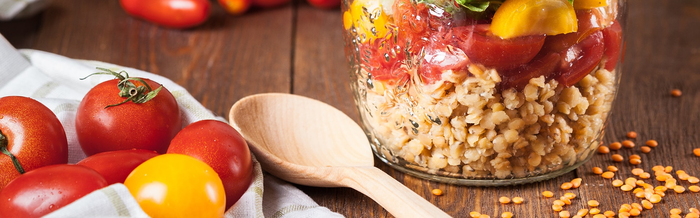

<!-- Logo -->

    

  

## 🧪 Tecnologias

Esse projeto foi desenvolvido com as seguintes tecnologias:
- [Django](https://www.djangoproject.com/)
- [Bootstrap](https://getbootstrap.com/)
## 💻 Projeto

Esse é um website feito para quem necessita consultar ou cadastrar receitas.

Este é um projeto desenvolvido com a equipe **[Alura](https://www.alura.com.br/)**
